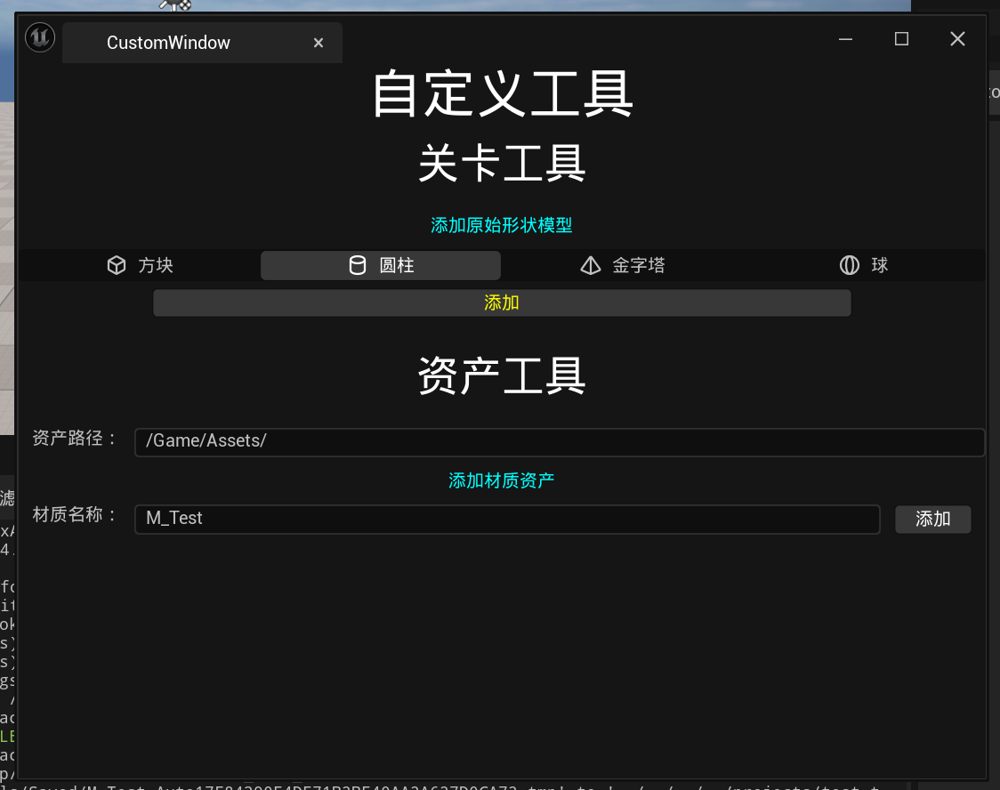
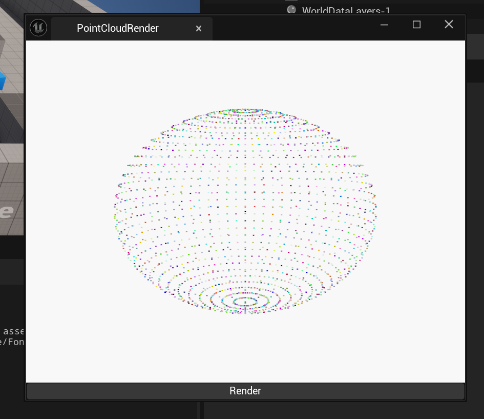

# unreal_plugin_demo

### [CustomWindow](CustomWindow)
 一个非常简单的unreal插件，展示如何使用c++编写原生用户界面工具，UE版本5.3.2

unreal 没有把它的原生界面 Slate 全部暴露到 python 所以目前只能通过 c++ 来实现，而它的编写语法很不一样，跟流行的用户界面库如QT等差别非常大，第一次接触的话是需要一段时间去适应的，而且不能直观的看到实际界面，建议可以先通过编辑器里的编辑器工具蓝图来先大概的把界面的布局做好，然后通过 c++ 来实现，这样比较直观。

如果不是必须要用原生界面的话，可以考虑使用 python 来写界面

如基于 pyside6 的: 
https://github.com/mackst/unreal_python_demo/blob/main/actorMoveInfo_pyside6.py

如基于 pyimgui 和 glfw 的: 
https://github.com/mackst/unreal_python_demo/blob/main/window_imgui_glfw.py

### [PointCloudRender](PointCloudRender)
这个插件展示如何使用C++第三方库，UE版本5.4.1

使用vulkan sdk，把
https://github.com/bkerbl/vulkan-compute-exercises/tree/main/07_PointCloudRender 做成了unreal插件